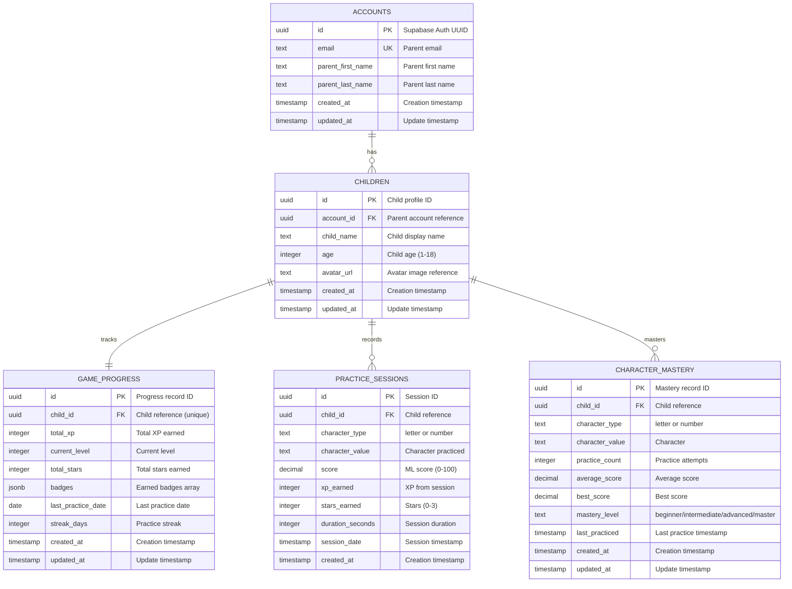

# Supabase Database Schema Documentation

## Overview

This document describes the complete database schema for the Children's Handwriting Learning App. The schema is designed with privacy, security, and COPPA compliance in mind.

## Database Architecture

### Design Principles

- **Privacy-First**: No handwriting data stored, only progress metadata
- **Secure by Default**: Row Level Security (RLS) enabled on all tables
- **COPPA Compliant**: All data collected through parent accounts
- **Automated Updates**: Triggers maintain data consistency
- **Scalable**: Designed to support thousands of users

## Entity Relationship Diagram



## Table Descriptions

### accounts

Stores parent account information linked to Supabase Auth.

**Key Features:**
- Primary key is Supabase Auth UUID
- Email must be unique
- Cascading delete removes all associated children and data

**Relationships:**
- One-to-many with `children`

### children

Stores child profiles associated with parent accounts.

**Key Features:**
- Auto-generated UUID primary key
- Age validation (1-18 years)
- Cascading delete removes all associated progress data
- Automatically creates `game_progress` record on insert

**Relationships:**
- Many-to-one with `accounts`
- One-to-one with `game_progress`
- One-to-many with `practice_sessions`
- One-to-many with `character_mastery`

### game_progress

Tracks overall game progress for each child (one-to-one relationship).

**Key Features:**
- Unique constraint on `child_id`
- Automatically updated by triggers after practice sessions
- Level calculated as: `FLOOR(total_xp / 100) + 1`
- Streak tracking with automatic reset logic

**Gamification Fields:**
- `total_xp`: Cumulative experience points
- `current_level`: Calculated from XP
- `total_stars`: Cumulative stars (0-3 per session)
- `badges`: JSONB array of badge objects
- `streak_days`: Consecutive practice days

### practice_sessions

Records individual practice session data.

**Key Features:**
- Immutable records (no UPDATE policy)
- Triggers automatic updates to `game_progress` and `character_mastery`
- Score range: 0-100 (from ML model)
- Stars range: 0-3 (based on score thresholds)

**Session Data:**
- Character practiced (type and value)
- ML evaluation score
- Rewards earned (XP and stars)
- Session duration and timestamp

### character_mastery

Tracks mastery progress for each character per child.

**Key Features:**
- Unique constraint on `(child_id, character_type, character_value)`
- Automatically updated by triggers after practice sessions
- Mastery level calculated based on average score and practice count

**Mastery Levels:**
- **Beginner**: Default level
- **Intermediate**: 60+ avg score, 5+ practices
- **Advanced**: 75+ avg score, 7+ practices
- **Master**: 90+ avg score, 10+ practices

## Row Level Security (RLS) Policies

All tables have RLS enabled with the following access patterns:

### accounts
- ✅ Users can SELECT/INSERT/UPDATE/DELETE their own account
- ❌ Users cannot access other accounts

### children
- ✅ Parents can SELECT/INSERT/UPDATE/DELETE their own children
- ❌ Parents cannot access other parents' children

### game_progress
- ✅ Parents can SELECT/INSERT/UPDATE/DELETE their own children's progress
- ❌ Parents cannot access other children's progress

### practice_sessions
- ✅ Parents can SELECT/INSERT their own children's sessions
- ✅ Parents can DELETE their own children's sessions
- ❌ Parents cannot UPDATE sessions (immutable records)
- ❌ Parents cannot access other children's sessions

### character_mastery
- ✅ Parents can SELECT/INSERT/UPDATE/DELETE their own children's mastery data
- ❌ Parents cannot access other children's mastery data

## Database Functions

### update_updated_at_column()

Automatically updates the `updated_at` timestamp on row updates.

**Applied to:**
- accounts
- children
- game_progress
- character_mastery

### calculate_mastery_level(avg_score, practice_count)

Calculates mastery level based on performance metrics.

**Logic:**
```
IF avg_score >= 90 AND practice_count >= 10 THEN 'master'
ELSIF avg_score >= 75 AND practice_count >= 7 THEN 'advanced'
ELSIF avg_score >= 60 AND practice_count >= 5 THEN 'intermediate'
ELSE 'beginner'
```

### update_character_mastery_after_practice()

Triggered after practice session insert. Updates character mastery statistics.

**Updates:**
- Increments practice count
- Recalculates average score
- Updates best score if new high
- Updates last practiced timestamp
- Recalculates mastery level

### update_game_progress_after_practice()

Triggered after practice session insert. Updates overall game progress.

**Updates:**
- Adds XP and stars to totals
- Recalculates current level
- Updates practice streak
- Updates last practice date

### initialize_game_progress()

Triggered after child insert. Creates initial game progress record.

## Common Queries

### Get all children for a parent

```sql
SELECT * FROM children
WHERE account_id = auth.uid()
ORDER BY created_at DESC;
```

### Get child's overall progress

```sql
SELECT * FROM game_progress
WHERE child_id = '<child_id>';
```

### Get recent practice sessions

```sql
SELECT * FROM practice_sessions
WHERE child_id = '<child_id>'
ORDER BY session_date DESC
LIMIT 20;
```

### Get character mastery overview

```sql
SELECT 
    character_type,
    character_value,
    mastery_level,
    average_score,
    practice_count
FROM character_mastery
WHERE child_id = '<child_id>'
ORDER BY mastery_level DESC, average_score DESC;
```

### Get practice statistics by character type

```sql
SELECT 
    character_type,
    COUNT(*) as total_sessions,
    AVG(score) as avg_score,
    SUM(xp_earned) as total_xp,
    SUM(stars_earned) as total_stars
FROM practice_sessions
WHERE child_id = '<child_id>'
GROUP BY character_type;
```

### Get daily practice history (last 30 days)

```sql
SELECT 
    DATE(session_date) as practice_date,
    COUNT(*) as sessions,
    AVG(score) as avg_score,
    SUM(xp_earned) as daily_xp
FROM practice_sessions
WHERE child_id = '<child_id>'
    AND session_date >= NOW() - INTERVAL '30 days'
GROUP BY DATE(session_date)
ORDER BY practice_date DESC;
```

## Data Privacy & Security

### Encryption
- All data encrypted at rest (Supabase default)
- Connections use SSL/TLS encryption
- Sensitive fields protected by RLS policies

### Data Retention
- No handwriting images stored
- Only progress metadata retained
- Parents can delete all child data
- Account deletion cascades to all related data

### COPPA Compliance
- No PII collected from children directly
- All data managed through parent accounts
- Parents have full visibility and control
- No third-party data sharing

## Migration Files

The schema is implemented through the following migration files (run in order):

1. [001_accounts_table.sql](file:///c:/Users/dhiaf/OneDrive/Desktop/ISS%20PROJECT/backend/supabase/migrations/001_accounts_table.sql) - Parent accounts
2. [002_children_table.sql](file:///c:/Users/dhiaf/OneDrive/Desktop/ISS%20PROJECT/backend/supabase/migrations/002_children_table.sql) - Child profiles
3. [003_game_progress_table.sql](file:///c:/Users/dhiaf/OneDrive/Desktop/ISS%20PROJECT/backend/supabase/migrations/003_game_progress_table.sql) - Game progress tracking
4. [004_practice_sessions_table.sql](file:///c:/Users/dhiaf/OneDrive/Desktop/ISS%20PROJECT/backend/supabase/migrations/004_practice_sessions_table.sql) - Practice session records
5. [005_character_mastery_table.sql](file:///c:/Users/dhiaf/OneDrive/Desktop/ISS%20PROJECT/backend/supabase/migrations/005_character_mastery_table.sql) - Character mastery tracking
6. [006_rls_policies.sql](file:///c:/Users/dhiaf/OneDrive/Desktop/ISS%20PROJECT/backend/supabase/migrations/006_rls_policies.sql) - Security policies
7. [007_functions_and_triggers.sql](file:///c:/Users/dhiaf/OneDrive/Desktop/ISS%20PROJECT/backend/supabase/migrations/007_functions_and_triggers.sql) - Automated functions

## Performance Considerations

### Indexes

The schema includes indexes on:
- `accounts.email` - Fast email lookups
- `children.account_id` - Fast parent-child queries
- `game_progress.child_id` - Fast progress lookups
- `practice_sessions.child_id` - Fast session queries
- `practice_sessions.session_date` - Fast date-range queries
- `character_mastery.child_id` - Fast mastery queries

### Query Optimization

- Use prepared statements for repeated queries
- Limit result sets with pagination
- Use indexes for filtering and sorting
- Avoid SELECT * in production code

## Next Steps

See [SUPABASE_SETUP.md](file:///c:/Users/dhiaf/OneDrive/Desktop/ISS%20PROJECT/docs/database/SUPABASE_SETUP.md) for setup instructions.
